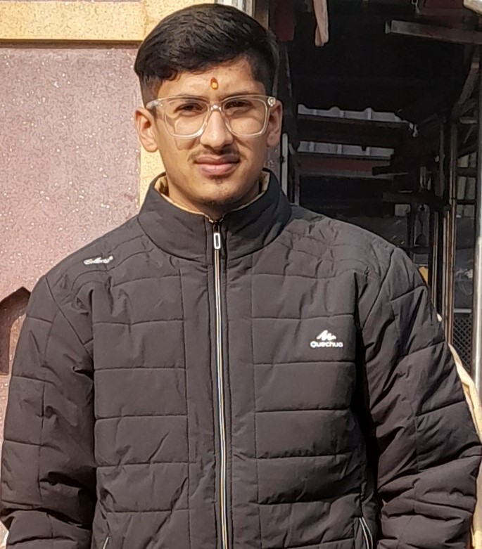
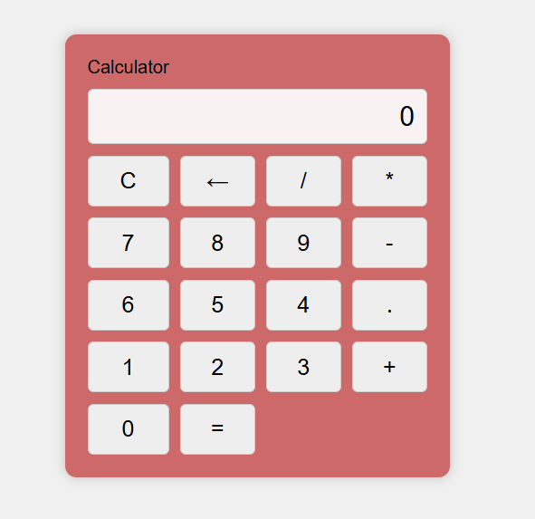

****************************************HTML****************************************
<!DOCTYPE html>
<html lang="en">
  <head>
    <meta charset="UTF-8" />
    <meta name="viewport" content="width=device-width, initial-scale=1.0" />
    <link rel="stylesheet" href="style.css" />
    <title>My Portfolio</title>
  </head>
  <body>
    <header>
      <h1>Rohit Joshi</h1>
      
Web Developer 

    </header>

    <section id="about">
      
    </section>

    <section id="about1">
      <h2>Hii everyone my name is Rohit Joshi.</h2>
        <h2>I'm a passionate web developer and designer with a keen eye for detail. Pursuing my BCA from Panjab University.
      </h2>
    </section>

    <section id="projects">
      <h2>Projects</h2>
      

        
        <h3>Project 1</h3>
        
Designed and coded a responsive website for providing web developement course easily by JavaScript-based.

      

      

        
        <h3>Project 2</h3>
        

          Experience the simplicity and elegance of my custom-built calculator, designed using HTML and CSS. 
        

      

    </section>
    <section id="resume">
      <h2>Resume</h2>
      
<a href="resume.png" download> Download Resume (PDF)</a>

    </section>
    <section id="contact">
      <h2>Contact</h2>
      
Email: rohitjoshi2899@gmail.com

      
Phone: +91 1234567890

    </section>
    <footer>
      
&copy; 2024 Rohit Joshi. All rights reserved.

    </footer>
  </body>
</html>
****************************************end****************************************

****************************************CSS****************************************
body {
    font-family: Arial, sans-serif;
    margin: 0;
    background-color: rgb(237, 240, 241);
    padding: 0;
  }
  header {
    background-color: #342d2d;
    color: #fff;
    text-align: center;
    padding: 20px 0;
  } 
  header h1 {
    margin: 0;
  } 
  #about1 {
    text-align: center;
    padding: 1px 0;
  }
  #about {
    text-align: center;
    padding: 20px 0;
  }
  #about img {
    width: 95px;
    border-radius: 20%;
    padding: 20px;
  }
  #skills {
    text-align: left;
    padding: 10px 0;
  }
  
  #skills ul {
    list-style: none;
  }
  #projects {
    text-align: center;
    padding: 20px 0;
  }
  .project {
    margin-bottom: 20px;
  }
  .project img {
    max-width: 30%;
    border-radius: 5px;
  }
  #resume,
  #contact {
    text-align: center;
    padding: 20px 0;
  }
  #resume a {
    text-decoration: none;
    color: #333;
    border: 1px solid #333;
    padding: 10px 20px;
    border-radius: 5px;
  } 
  footer {
    background-color: #391515;
    color: #d28888;
    text-align: center;
    padding: 20px 0;
  }
  ****************************************end****************************************
